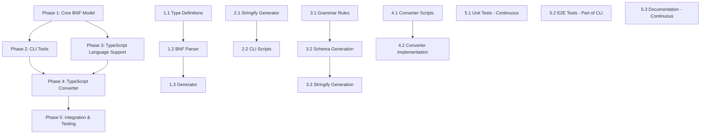

# BNF 模型实现规划文档

## 项目概述

基于 BNF (巴科斯-诺尔范式) 的语法规则模型设计与实现，支持 Token、推导和联合规则。该模型将用于描述编程语言的语法结构，并提供从 TypeScript AST 到 BNF 语法树的转换能力。

## 实施阶段规划

### Phase 1: 核心 BNF 模型基础设施 (第一阶段)

#### 1.1 核心类型定义
- **文件**: `src/core/bnf-model/types.ts`
- **内容**: 
  - 定义 `BaseNode<M>`, `TokenNode<M>`, `DeductionNode<M>`, `UnionNode<M>`
  - 定义 `TokenPattern`, `DeductionElement` 等辅助类型
  - 定义 `BNFModel<M>` 根类型
- **预计耗时**: 0.5天
- **注意**: 探索性开发，不强制时间要求

#### 1.2 BNF 模型解析器
- **文件**: `src/core/bnf-model/bnf-parser.ts`
- **功能**:
  - 实现 `parseBNF<M>(input: any)` 函数，从 JSON/YAML 解析的 object 验证并转换为 BNFModel<M>
  - 返回类型: `{ success: true, bnf: BNFModel<M>, warnings?: string[] } | { success: false, errors: string[], warnings?: string[] }`
  - 验证 BNF 模型的完整性和正确性
  - 检查节点类型、引用关系、循环依赖
  - 验证 Token 模式、正则表达式的有效性
  - 检查 DeductionElement 的属性命名规范
- **注意**: 探索性开发，重在类型安全的解析和验证

#### 1.3 语法树生成器
- **文件**: `src/core/bnf-model/generator.ts`
- **功能**:
  - 根据 BNF 模型生成 TypeScript 类型定义
  - 生成 Token 类型、Deduction 对象类型、Union 联合类型
  - 输出文件结构管理 (`token-types.ts`, `node/*.ts`, 常量文件等)
  - 处理依赖关系和导入语句
  - **代码质量检查**: 验证生成的 TypeScript 代码语法和类型正确性
- **注意**: 探索性开发，重点在于代码质量而非时间进度

### Phase 2: 命令行工具开发 (第二阶段)

#### 2.1 代码生成增强 ✅ (已完成)
- **文件**: `src/core/bnf-model/stringify-generator.ts`
- **功能**:
  - 生成递归的代码字符串化函数
  - 处理 Token 和 Deduction 节点的输出逻辑
  - 支持格式化选项和缩进控制
  - 完整的 StringifyGenerator 类实现
  - 配置选项支持和测试覆盖

#### 2.2 BNF 模型工具脚本
- **文件**: `scripts/bnf-model.ts`
- **子命令**:
  - `validate`: 验证 BNF 模型正确性
  - `generate schema`: 生成 TypeScript 类型定义
  - `generate stringify`: 生成字符串化函数 (依赖 2.1)
- **集成**: 注册到 `package.json` 脚本

### Phase 3: TypeScript 语言支持 (第三阶段)

#### 3.1 TypeScript 语法规则模型
- **文件**: `src/core/languages/typescript/syntax.bnf.ts`
- **内容**:
  - **分阶段实现**: 生成架子 + 手工补全的混合模式
  - **第一步**: 基于所有 SyntaxKind 自动生成 TokenNode 和 DeductionNode 的基础框架
  - **第二步**: 手工逐步补全和完善语法规则定义
  - 包含 Token 定义 (关键字、标识符、字面量等)
  - 包含语句、表达式、声明的推导规则
  - 包含联合类型定义 (如 Statement, Expression 等)
  - 添加 SyntaxKind 元数据映射
- **注意**: 探索性开发，重在质量和准确性

#### 3.2 自动生成 Schema 和类型
- **文件**: `src/core/languages/typescript/schema/`
- **内容**:
  - 运行生成器产生的 TypeScript 类型定义
  - Token 常量、优先级、结合性注册表
  - 完整的导出索引文件
- **注意**: 自动生成，需要验证输出质量

#### 3.3 字符串化函数生成
- **文件**: `src/core/languages/typescript/stringify.ts`
- **功能**:
  - 从生成的语法树节点重新构造 TypeScript 代码
  - 支持格式化和美化输出
  - 处理空白、注释的保留
- **注意**: 自动生成，需要验证输出质量

### Phase 4: TypeScript 转换器 (第四阶段)

#### 4.1 转换器脚本生成
- **文件**: `scripts/generate-from-ts-node.ts`
- **功能**:
  - 基于 BNF 模型和元数据生成转换函数
  - 创建 `ts.Node` → BNF 语法树的映射
  - 实现递归转换逻辑和查表函数
- **注意**: 探索性开发，重在转换准确性

#### 4.2 转换器实现
- **文件**: `src/core/languages/typescript/fromTsNode/`
- **内容**:
  - 自动生成的转换函数集合
  - 通用节点转换器 (switch-case 查表)
  - 每个 SyntaxKind 对应的专用转换函数
- **注意**: 自动生成，需要验证转换正确性

### Phase 5: 集成与测试 (第五阶段)

#### 5.1 单元测试 (穿插开发)
- **文件**: `src/core/bnf-model/__tests__/`
- **覆盖**:
  - BNF 模型验证器测试
  - 语法树生成器测试
  - 字符串化函数测试
  - TypeScript 转换器测试
- **注意**: **不要延迟到最后**，在各个核心模块开发过程中同步编写测试

#### 5.2 端到端测试 (CLI 功能测试)
- **文件**: `src/core/languages/typescript/__tests__/` 和 CLI 测试
- **场景**:
  - TypeScript 代码 → ts.Node → BNF 语法树 → 字符串化
  - 往返一致性测试
  - 复杂语法结构测试
  - CLI 命令端到端测试
- **注意**: 这是 CLI 实现的一部分，不是独立的测试阶段

#### 5.3 文档和示例
- **文件**: 
  - `docs/bnf-model-guide.md` - 使用指南
  - `docs/typescript-bnf-schema.md` - TypeScript BNF 架构说明
  - `examples/` - 使用示例
- **注意**: 随开发进度同步更新文档

## 技术架构图

```
┌─────────────────────────────────────────────────────────────┐
│                    BNF Model Core                          │
├─────────────────────────────────────────────────────────────┤
│  types.ts          │  bnf-parser.ts    │  generator.ts      │
│  └─ Basic Types    │  └─ Validation    │  └─ Code Gen       │
└─────────────────────────────────────────────────────────────┘
                                │
                ┌───────────────┼───────────────┐
                │               │               │
┌───────────────▼─────┐ ┌───────▼──────┐ ┌─────▼─────────────┐
│  Command Line Tools │ │  TypeScript  │ │  Future Languages │
│                     │ │  Language    │ │  (JavaScript,     │
│  bnf-model.ts       │ │  Support     │ │   Python, etc.)   │
│  └─ validate        │ │              │ │                   │
│  └─ generate schema │ │              │ │                   │
│  └─ generate stringify│              │ │                   │
└─────────────────────┘ └───────┬──────┘ └───────────────────┘
                                │
                    ┌───────────▼──────────┐
                    │  TypeScript Support  │
                    ├──────────────────────┤
                    │  syntax.bnf.ts       │
                    │  └─ Grammar Rules    │
                    │                      │
                    │  schema/ (generated) │
                    │  └─ Type Definitions │
                    │                      │
                    │  stringify.ts (gen)  │
                    │  └─ Code Generator   │
                    │                      │
                    │  fromTsNode/ (gen)   │
                    │  └─ Converters       │
                    └──────────────────────┘
```

## 实施依赖关系



## 风险评估与缓解

### 高风险项
1. **TypeScript 语法规则复杂性**
   - 风险: TypeScript 语法极其复杂，可能遗漏边缘情况
   - 缓解: 分阶段实现，先支持核心语法，逐步扩展

2. **往返一致性**
   - 风险: ts.Node → BNF → 字符串化可能丢失信息
   - 缓解: 充分的测试覆盖，保留必要的元信息

### 中风险项
1. **性能考虑**
   - 风险: 递归转换可能影响性能
   - 缓解: 优化数据结构，考虑缓存机制

2. **代码生成复杂度**
   - 风险: 自动生成的代码可能难以调试
   - 缓解: 生成清晰的代码结构，添加调试信息

## 成功标准

1. **功能完整性**
   - ✅ BNF 模型能准确描述 TypeScript 核心语法
   - ✅ 从 ts.Node 到 BNF 语法树转换无误
   - ✅ 字符串化输出能重新解析为相同的 AST

2. **工程质量**
   - ✅ 代码覆盖率 > 90%
   - ✅ 所有命令行工具正常工作
   - ✅ 文档完整，示例清晰

3. **性能指标**
   - ✅ 转换 1000 行 TypeScript 代码 < 1秒
   - ✅ 内存使用合理，无明显泄漏

## 开发方法与原则

### Vibe Coding 方法
- **探索性开发**: 项目更多是探索性的，不做严格的时间要求
- **质量优先**: 重点关注代码质量、类型安全和功能正确性
- **迭代改进**: 允许在开发过程中调整设计和实现方案
- **持续验证**: 每个模块都要确保生成的代码语法和类型正确

### 开发流程
1. **TDD 方式**: 单元测试穿插在各个核心模块开发过程中
2. **持续集成**: CLI 端到端测试作为功能实现的一部分
3. **文档同步**: 重要更改随时更新相关文档
4. **代码审查**: 生成的代码需要验证语法和类型正确性

## 总预计耗时

- **Phase 1**: 核心 BNF 模型基础设施
- **Phase 2**: 命令行工具开发 (注意优先级调整)
- **Phase 3**: TypeScript 语言支持 (生成 + 手工混合模式)
- **Phase 4**: TypeScript 转换器
- **Phase 5**: 集成与测试 (穿插进行)

**注意**: 采用 Vibe Coding 方法，不设定严格时间限制，重在探索和质量

## 下一步行动

1. **创建目录结构** (已完成)
2. **开始 Phase 1.1**: 实现核心类型定义，注重类型安全
3. **同步编写测试**: 每个模块都要有对应的单元测试
4. **验证生成代码**: 确保所有生成的 TypeScript 代码语法正确
5. **注意开发顺序**: Phase 2 中先做 stringify-generator，再做 CLI 脚本
6. **混合开发模式**: Phase 3 中先生成架子，再手工补全语法规则
