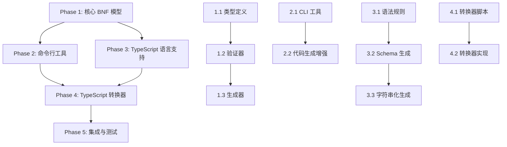

# BNF 模型实现规划文档

## 项目概述

基于 BNF (巴科斯-诺尔范式) 的语法规则模型设计与实现，支持 Token、推导和联合规则。该模型将用于描述编程语言的语法结构，并提供从 TypeScript AST 到 BNF 语法树的转换能力。

## 实施阶段规划

### Phase 1: 核心 BNF 模型基础设施 (第一阶段)

#### 1.1 核心类型定义
- **文件**: `src/core/bnf-model/types.ts`
- **内容**: 
  - 定义 `BaseNode<M>`, `TokenNode<M>`, `DeductionNode<M>`, `UnionNode<M>`
  - 定义 `TokenPattern`, `DeductionElement` 等辅助类型
  - 定义 `BNFModel<M>` 根类型
- **预计耗时**: 0.5天

#### 1.2 模型验证器
- **文件**: `src/core/bnf-model/validator.ts`
- **功能**:
  - 验证 BNF 模型的完整性和正确性
  - 检查节点类型、引用关系、循环依赖
  - 验证 Token 模式、正则表达式的有效性
  - 检查 DeductionElement 的属性命名规范
- **预计耗时**: 1天

#### 1.3 语法树生成器
- **文件**: `src/core/bnf-model/generator.ts`
- **功能**:
  - 根据 BNF 模型生成 TypeScript 类型定义
  - 生成 Token 类型、Deduction 对象类型、Union 联合类型
  - 输出文件结构管理 (`token-types.ts`, `node/*.ts`, 常量文件等)
  - 处理依赖关系和导入语句
- **预计耗时**: 2天

### Phase 2: 命令行工具开发 (第二阶段)

#### 2.1 BNF 模型工具脚本
- **文件**: `scripts/bnf-model.ts`
- **子命令**:
  - `validate`: 验证 BNF 模型正确性
  - `generate schema`: 生成 TypeScript 类型定义
  - `generate stringify`: 生成字符串化函数
- **集成**: 注册到 `package.json` 脚本
- **预计耗时**: 1天

#### 2.2 代码生成增强
- **文件**: `src/core/bnf-model/stringify-generator.ts`
- **功能**:
  - 生成递归的代码字符串化函数
  - 处理 Token 和 Deduction 节点的输出逻辑
  - 支持格式化选项和缩进控制
- **预计耗时**: 1天

### Phase 3: TypeScript 语言支持 (第三阶段)

#### 3.1 TypeScript 语法规则模型
- **文件**: `src/core/languages/typescript/syntax.bnf.ts`
- **内容**:
  - 手工编写 TypeScript 核心语法的 BNF 规则
  - 包含 Token 定义 (关键字、标识符、字面量等)
  - 包含语句、表达式、声明的推导规则
  - 包含联合类型定义 (如 Statement, Expression 等)
  - 添加 SyntaxKind 元数据映射
- **预计耗时**: 3天

#### 3.2 自动生成 Schema 和类型
- **文件**: `src/core/languages/typescript/schema/`
- **内容**:
  - 运行生成器产生的 TypeScript 类型定义
  - Token 常量、优先级、结合性注册表
  - 完整的导出索引文件
- **预计耗时**: 0.5天 (自动生成)

#### 3.3 字符串化函数生成
- **文件**: `src/core/languages/typescript/stringify.ts`
- **功能**:
  - 从生成的语法树节点重新构造 TypeScript 代码
  - 支持格式化和美化输出
  - 处理空白、注释的保留
- **预计耗时**: 0.5天 (自动生成)

### Phase 4: TypeScript 转换器 (第四阶段)

#### 4.1 转换器脚本生成
- **文件**: `scripts/generate-from-ts-node.ts`
- **功能**:
  - 基于 BNF 模型和元数据生成转换函数
  - 创建 `ts.Node` → BNF 语法树的映射
  - 实现递归转换逻辑和查表函数
- **预计耗时**: 1.5天

#### 4.2 转换器实现
- **文件**: `src/core/languages/typescript/fromTsNode/`
- **内容**:
  - 自动生成的转换函数集合
  - 通用节点转换器 (switch-case 查表)
  - 每个 SyntaxKind 对应的专用转换函数
- **预计耗时**: 0.5天 (自动生成)

### Phase 5: 集成与测试 (第五阶段)

#### 5.1 单元测试
- **文件**: `src/core/bnf-model/__tests__/`
- **覆盖**:
  - BNF 模型验证器测试
  - 语法树生成器测试
  - 字符串化函数测试
  - TypeScript 转换器测试
- **预计耗时**: 2天

#### 5.2 端到端测试
- **文件**: `src/core/languages/typescript/__tests__/`
- **场景**:
  - TypeScript 代码 → ts.Node → BNF 语法树 → 字符串化
  - 往返一致性测试
  - 复杂语法结构测试
- **预计耗时**: 1天

#### 5.3 文档和示例
- **文件**: 
  - `docs/bnf-model-guide.md` - 使用指南
  - `docs/typescript-bnf-schema.md` - TypeScript BNF 架构说明
  - `examples/` - 使用示例
- **预计耗时**: 1天

## 技术架构图

```
┌─────────────────────────────────────────────────────────────┐
│                    BNF Model Core                          │
├─────────────────────────────────────────────────────────────┤
│  types.ts          │  validator.ts     │  generator.ts      │
│  └─ 基础类型定义      │  └─ 模型验证       │  └─ 代码生成        │
└─────────────────────────────────────────────────────────────┘
                                │
                ┌───────────────┼───────────────┐
                │               │               │
┌───────────────▼─────┐ ┌───────▼──────┐ ┌─────▼─────────────┐
│  Command Line Tools │ │  TypeScript  │ │  Future Languages │
│                     │ │  Language    │ │  (JavaScript,     │
│  bnf-model.ts       │ │  Support     │ │   Python, etc.)   │
│  └─ validate        │ │              │ │                   │
│  └─ generate schema │ │              │ │                   │
│  └─ generate stringify│              │ │                   │
└─────────────────────┘ └───────┬──────┘ └───────────────────┘
                                │
                    ┌───────────▼──────────┐
                    │  TypeScript Support  │
                    ├──────────────────────┤
                    │  syntax.bnf.ts       │
                    │  └─ 语法规则定义       │
                    │                      │
                    │  schema/ (生成)       │
                    │  └─ 类型定义          │
                    │                      │
                    │  stringify.ts (生成)  │
                    │  └─ 字符串化函数       │
                    │                      │
                    │  fromTsNode/ (生成)   │
                    │  └─ 转换函数          │
                    └──────────────────────┘
```

## 实施依赖关系



## 风险评估与缓解

### 高风险项
1. **TypeScript 语法规则复杂性**
   - 风险: TypeScript 语法极其复杂，可能遗漏边缘情况
   - 缓解: 分阶段实现，先支持核心语法，逐步扩展

2. **往返一致性**
   - 风险: ts.Node → BNF → 字符串化可能丢失信息
   - 缓解: 充分的测试覆盖，保留必要的元信息

### 中风险项
1. **性能考虑**
   - 风险: 递归转换可能影响性能
   - 缓解: 优化数据结构，考虑缓存机制

2. **代码生成复杂度**
   - 风险: 自动生成的代码可能难以调试
   - 缓解: 生成清晰的代码结构，添加调试信息

## 成功标准

1. **功能完整性**
   - ✅ BNF 模型能准确描述 TypeScript 核心语法
   - ✅ 从 ts.Node 到 BNF 语法树转换无误
   - ✅ 字符串化输出能重新解析为相同的 AST

2. **工程质量**
   - ✅ 代码覆盖率 > 90%
   - ✅ 所有命令行工具正常工作
   - ✅ 文档完整，示例清晰

3. **性能指标**
   - ✅ 转换 1000 行 TypeScript 代码 < 1秒
   - ✅ 内存使用合理，无明显泄漏

## 总预计耗时

- **Phase 1**: 3.5天
- **Phase 2**: 2天  
- **Phase 3**: 4天
- **Phase 4**: 2天
- **Phase 5**: 4天

**总计**: 15.5天 (约 3周)

## 下一步行动

1. 创建目录结构
2. 实现核心类型定义
3. 开始 Phase 1 的开发工作
